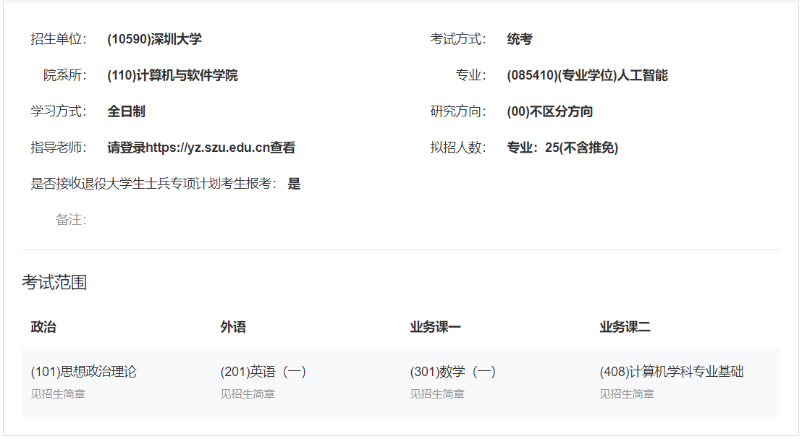

# 前期准备

#### 靠前准备

1.报考专业历年来的录取分数情况

2.录取人数

3.报录比

4.最高分、最低分


#### 考试内容

> 


#### 深圳大学考研科目分析

> 1. 深圳大学计算机考研难度怎样，性价比好吗？学硕专硕差别大吗？
>
>    ```http
>    https://www.zhihu.com/question/288412593/answer/2150647347


#### 消息获取

> 1. 消息获取渠道（非考研）
>
>    ```http
>    https://www.zhihu.com/question/36809525/answer/1965470820
>    ```
>
> 2. 渠道资料获取
>
>    ```http
>    https://www.zhihu.com/question/359458729/answer/2896794886
>    ```
>    
> 3. 考研到底要不要冲名校?
>
>    ```http
>    https://www.zhihu.com/question/548305946/answer/2659968843
>


#### 英语一和英语二的区别

> 1. 怎么还有人不明白考研英一英二的区别啊啊啊啊
>
>    ```http
>    https://zhuanlan.zhihu.com/p/623794642
>    ```
>    
> 2. 考研英语
>
>    ```http
>    https://www.zhihu.com/question/269766334/answer/3088262391
>    ```
>


#### 软件工程 408

> 1. 软件工程考研专业课408到底是个什么鬼?
>
>    ```http
>    https://www.zhihu.com/question/338556273/answer/2744447252
>    ```
>


#### 总杂

1. 大的8.9T

   ```http
   https://www.aliyundrive.com/s/skGZZMMJi3F/folder/63f7566eb5e1af8ebbb042cea45749452f2088b1

2. 夸克

   ```http
   https://pan.quark.cn/s/468a5e5cae70#/list/share


#### 总分层

1. 公共课

   ```http
   https://pan.baidu.com/s/1aM2GS9KcJgsrVgkocDoPyA?pwd=6666
   ```

2. 专业课

   ```http
   https://pan.baidu.com/share/init?surl=iSlfGFsMHMYXId2BhefyEQ&pwd=6666
   ```
   
3. 24考研复试

   ```http
   https://pan.baidu.com/share/init?surl=Gcsbg4VsyhVuVZYNvmI_AA&pwd=6666


#### 真题

> 1. 公共课 公众号【不易学长】回复公共课真题
> 2. 专业课 公众号【不易学长】回复专业课真题


#### 政治

1. 7月份开始, 教材一定要用最新的
2. 肖秀荣【1000题】【肖四、肖八】【背诵笔记】
3. 徐涛强化课【核心考案】【优题库】【**背诵手册**】
4. 腿姐 30天70分，技巧班


#### 数一（高数、线代、概率论）

1. 3-6基础(基础框架, 基本知识点), 7-9强化(大量刷题, 保证正确率), 10-考试冲刺(套题+总结+回顾知识点)
2. 张宇(18讲，30讲，36讲)【张宇1000题(难度高)】【张宇8+4(模拟卷)】
3. **高数推荐:**武忠祥【武忠祥严选题330】
4. 汤家凤
5. **线代推荐:**李永乐【李永乐的复习全书】【李永乐660(更好)】【李永乐的历年真题解析】【李永乐6+3(模拟卷)】
6. 【李林的880(难度低一点)】【李林6+4(模拟卷)】, 方浩
7. **线代推荐:**汤家凤1800
8. 概率论**余丙森**、王式安
9. 李林押题券6(不一定要做, 看时间)+4(一定要做)
10. 薛威基础补充
11. 【李艳芳3套卷(模拟卷)】


#### 英一

1. 红包书(最全面)、考研真相(四轮复习概念)、考研词汇闪过(效率高)【单词→语法→阅读→写作→三小]】

2. 真题解析 黄剑【黄皮书】 或 【考研真相】，公众号【不易学长】回复250207获取文章的单词翻译标注

   真题高频词>真题低频词>未考大纲词>超纲词

   1. 颉斌斌、唐迟、易熙人的网课（8-10）

   2. 田静（语法课、放弃）

      ```http
      https://pan.baidu.com/s/1joehXVsbAfaxrWLbQXGoGw#list/path=%2F
      6666

   3. 颉斌斌(阅读)技巧层面，重视应试 基础一般.【阅读方法应试宝】

      ```http
      https://pan.baidu.com/s/1W1jpVoIU9cvTIVxUZfsAvQ#list/path=%2F&parentPath=%2Fsharelink2170729529-1121944109701842
      6666
      ```

   4. 唐迟(阅读) 逻辑层面，重视积累基础好【】阅读的逻辑

      ```http
      https://pan.baidu.com/s/1Lvvcc8IVENMczcBtgKTb7A#list/path=%2F
      6666
      ```

3. 新题型**宋逸轩**、刘琦(三小门)

4. 完型宋逸轩(三小门)

5. 翻译唐静(三小门)

6. 作文**石雷鹏(8-10)**monkey王江涛


#### 408

1. **分值**：数据结构45分、计组45分、操作系统35分、计网25分 推荐**王道**
2. **题型**：选择题2分*40题=80分；大题7道题，共70分。
3. **复习难度**：计组>操作系统>数据结构>计算机网络
4. **复习顺序**：数据结构、计组、操作系统、计网科目介绍：数据结构重理论，计组概念多，容易混淆，操作系统部分章节和计组结合紧密，计算机网络记忆点很多，请放到最后复习。
5. **数据结构**：参考书《数据结构（C 语言版）》严蔚敏，复习资料《数据结构考研复习指导》王道。
6. **计算机组成原理**：参考书《计算机组成原理（第 2 版）》唐朔飞，复习资料《计算机组成原理考研复习指导》王道
7. **操作系统**：参考书《计算机操作系统(第四版)》汤小丹，复习资料《计算机操作系统考研复习指导》王道
8. **计算机网络**：参考书《计算机网络(第 7 版)》谢希仁，复习资料《计算机网络考研复习指导》王道


#### 资源网站

> 1. 公共课
>
>    ```http
>    https://pan.baidu.com/share/init?surl=aM2GS9KcJgsrVgkocDoPyA&pwd=6666
>    ```
>
> 2. 专业课
>
>    ```http
>    https://pan.baidu.com/share/init?surl=iSlfGFsMHMYXId2BhefyEQ&pwd=6666
>    ```


# 咨询活动

#### 时间

> 2024年9月26日-2024年9月29日


#### 咨询内容

> 1. 历年分数线、报录比
> 2. 推免人数、实际拟录取人数
> 3. 研究生奖学金
> 4. 官网未明确公布或模糊信息
> 5. 考研报考资格或特殊招生政策，尤其报考点变动
> 6. 招生专业和专业考试科目
> 7. 往届生非户籍所在地考试证明材料


# 关于复试

## 时间

> 1. 三月中下旬这样, 一般**3月11日**这样往后


s	
